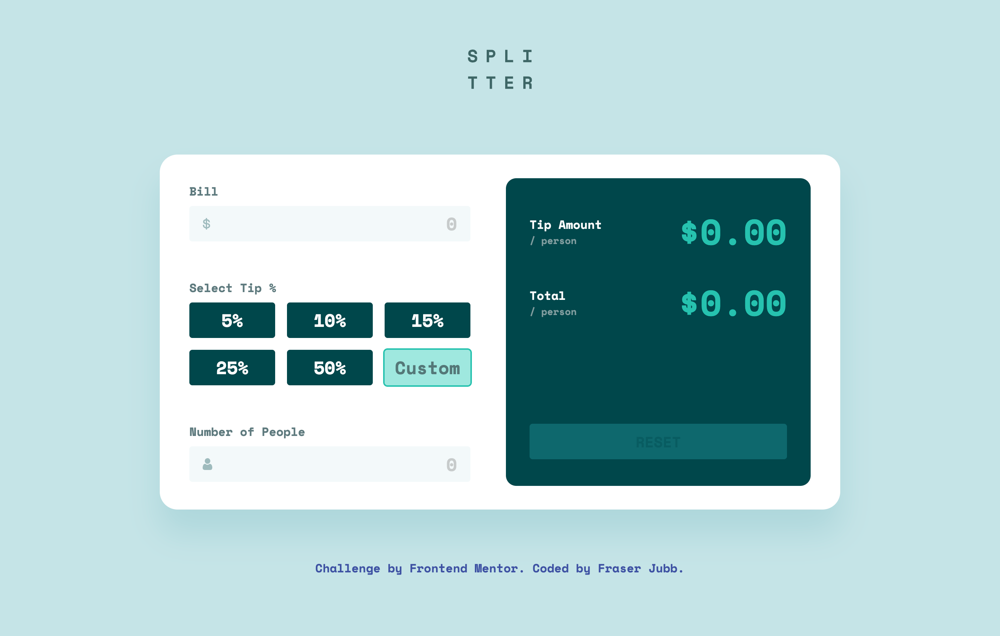

# FM - Tip calculator app Solution - Fraser Jubb

This is a solution to [this challenge on Frontend Mentor](https://www.frontendmentor.io/challenges/tip-calculator-app-ugJNGbJUX).

## 📖 Table of contents

- [Overview](#overview)
  - [Project Screenshot](#project-screenshot)
  - [Project Links](#project-links)
- [My Process](#my-process)
  - [Built With](#built-with)
  - [What I Learned](#what-i-learned)
  - [Continued Development](#continued-development)
  - [Useful Resources](#useful-resources)
- [Noteworthy Updates Since Initial Submission](#noteworthy-updates-since-initial-submission)
- [Connect With Me](#connect-with-me)

## Overview

### Project Screenshot



### Project Links

- Solution URL: [Click Here](https://fm-tipcalculatorapp-fraser.netlify.app/)
- Live Site URL: [Click Here](INSERT URL HERE)
- Frontend Mentor Profile: [@fraserjubb](https://www.frontendmentor.io/profile/fraserjubb)

## My Process

### Built With

- HTML
- CSS
- JavaScript
- Desktop-First Workflow

### Enhancements Beyond the Brief

While this challenge is labelled “Junior” on Frontend Mentor, I’ve implemented a few enhancements that go slightly beyond the brief:

- Text inputs with sanitisation to control decimals, max values, and prevent invalid characters.
- Defensive validation to prevent invalid calculations (e.g., zero people, trailing decimals).
- Ensured only one tip source (preset or custom) can be active at a time.
- Small UX enhancements: blur on Enter, dynamic % symbol positioning.
- Tip calculations only occur when all required inputs are present to avoid partial or misleading values.

### What I Learned

In this project, I gained experience with:

1. Hiding radio inputs with CSS while still allowing them to be selected via their labels.

2. Adding a visually-hidden `<h1>` to provide a proper page title, since the design has no visible heading. This improves accessibility for screen readers and SEO.

3. Using the `change` event listener for better control of element behavior.

4. Using array destructuring with `split()` to quickly assign the integer and decimal parts of a string to separate variables, making input formatting and decimal control easier:

```js
let [integerPart, decimalPart] = '123.45'.split('.');
// integerPart = "123", decimalPart = "45"
```

5. Implemented defensive input validation to prevent invalid calculation states (e.g., zero people, trailing decimals), ensuring reliable app behavior.

6. Managed mutually exclusive tip selection (preset vs. custom) in JavaScript, demonstrating control over dynamic UI states.

7. Learned to dynamically adjust UI elements (like the % symbol in the custom tip input) based on user input length, improving UX polish.

### Continued Development

After submitting this project, I wish to develop the following:

1. More JavaScript practice to increase my writing speed and thought process on projects.

### Useful Resources

- [MDN page for radio inputs (Documentation)](https://developer.mozilla.org/en-US/docs/Web/HTML/Reference/Elements/input/radio)

## Noteworthy Updates Since Initial Submission

1. No major updates since submitted.

## Connect With Me

<a href="https://github.com/fraserjubb"></a>
<a href="https://www.linkedin.com/in/fraser-jubb"></a>
<a href="https://www.instagram.com/thejubbzone/"></a>
<a href="https://x.com/fraserjubb"></a>
<a href="https://www.youtube.com/@thejubbzone2374"></a>
<a href="mailto:fraserjubb.dev@gmail.com"></a>

<br/>
